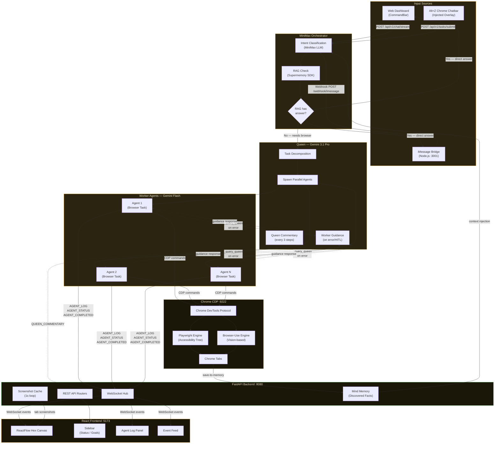
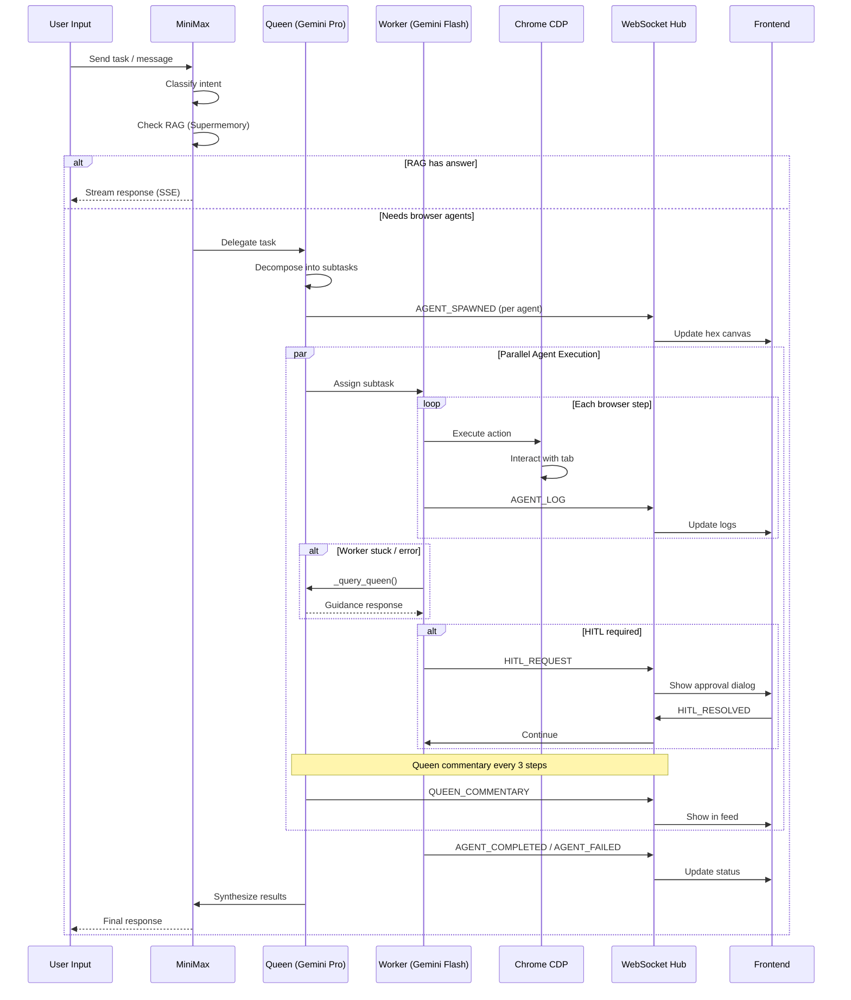
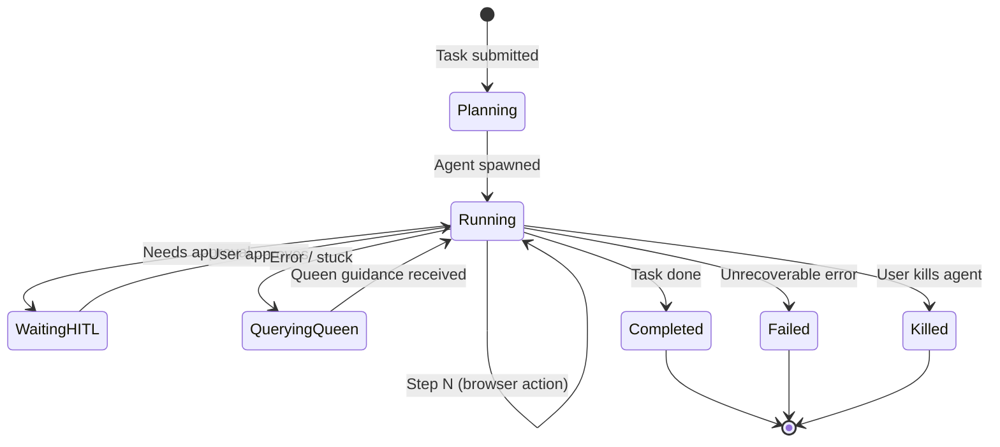
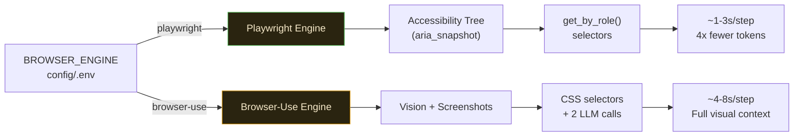

# Hivemind System Workflow

## High-Level Architecture

```mermaid
flowchart TD
    subgraph Input["Input Sources"]
        WEB["Web Dashboard\n(CommandBar)"]
        IMSG["iMessage Bridge\n(Node.js :3001)"]
        CHATBAR["Alt+Z Chrome Chatbar\n(Injected Overlay)"]
    end

    subgraph Orchestrator["MiniMax Orchestrator"]
        CLASSIFY["Intent Classification\n(MiniMax LLM)"]
        RAG["RAG Check\n(Supermemory SDK)"]
        DECIDE{RAG has\nanswer?}
    end

    subgraph Queen["Queen — Gemini 3.1 Pro"]
        DECOMPOSE["Task Decomposition"]
        ASSIGN["Spawn Parallel Agents"]
        NARRATE["Queen Commentary\n(every 3 steps)"]
        GUIDE["Worker Guidance\n(on error/HITL)"]
    end

    subgraph Workers["Worker Agents — Gemini Flash"]
        W1["Agent 1\n(Browser Task)"]
        W2["Agent 2\n(Browser Task)"]
        W3["Agent N\n(Browser Task)"]
    end

    subgraph Browser["Chrome CDP :9222"]
        CDP["Chrome DevTools Protocol"]
        PW["Playwright Engine\n(Accessibility Tree)"]
        BU["Browser-Use Engine\n(Vision-based)"]
        TABS["Chrome Tabs"]
    end

    subgraph Backend["FastAPI Backend :8080"]
        WS["WebSocket Hub"]
        REST["REST API Routers"]
        SCREEN["Screenshot Cache\n(1s loop)"]
        MEMORY["Mind Memory\n(Discovered Facts)"]
    end

    subgraph Frontend["React Frontend :5173"]
        CANVAS["ReactFlow Hex Canvas"]
        SIDEBAR["Sidebar\n(Status / Goals)"]
        LOGS["Agent Log Panel"]
        FEED["Event Feed"]
    end

    %% Input → Orchestrator
    WEB -->|POST /api/v1/chat/stream| CLASSIFY
    IMSG -->|Webhook POST /webhook/imessage| CLASSIFY
    CHATBAR -->|POST /api/v1/tasks/submit| CLASSIFY

    %% Orchestrator flow
    CLASSIFY --> RAG
    RAG --> DECIDE
    DECIDE -->|Yes — direct answer| WEB
    DECIDE -->|Yes — direct answer| IMSG
    DECIDE -->|No — needs browser| DECOMPOSE

    %% Queen → Workers
    DECOMPOSE --> ASSIGN
    ASSIGN --> W1 & W2 & W3
    NARRATE -.->|QUEEN_COMMENTARY| WS

    %% Workers → Browser
    W1 & W2 & W3 -->|CDP commands| CDP
    CDP --> PW
    CDP --> BU
    PW & BU --> TABS

    %% Worker ↔ Queen feedback loop
    W1 & W2 & W3 -.->|_query_queen\non error| GUIDE
    GUIDE -.->|guidance response| W1 & W2 & W3

    %% Workers → Backend events
    W1 & W2 & W3 -->|AGENT_LOG\nAGENT_STATUS\nAGENT_COMPLETED| WS

    %% Backend → Frontend
    WS -->|WebSocket events| CANVAS & LOGS & FEED
    SCREEN -->|tab screenshots| CANVAS
    REST --> SIDEBAR

    %% Memory
    TABS -->|save-to-memory| MEMORY
    MEMORY -->|context injection| CLASSIFY

    style Input fill:#2a2410,stroke:#D4920B,color:#F5E8C8
    style Orchestrator fill:#2a2410,stroke:#D4920B,color:#F5E8C8
    style Queen fill:#2a2410,stroke:#C8A84E,color:#F5E8C8
    style Workers fill:#2a2410,stroke:#E8A30C,color:#F5E8C8
    style Browser fill:#1a1608,stroke:#8B7A4A,color:#F5E8C8
    style Backend fill:#1a1608,stroke:#4CAF50,color:#F5E8C8
    style Frontend fill:#1a1608,stroke:#D4920B,color:#F5E8C8
```

## WebSocket Event Flow

```mermaid
sequenceDiagram
    participant User as User Input
    participant MM as MiniMax
    participant Q as Queen (Gemini Pro)
    participant W as Worker (Gemini Flash)
    participant CDP as Chrome CDP
    participant WS as WebSocket Hub
    participant UI as Frontend

    User->>MM: Send task / message
    MM->>MM: Classify intent
    MM->>MM: Check RAG (Supermemory)

    alt RAG has answer
        MM-->>User: Stream response (SSE)
    else Needs browser agents
        MM->>Q: Delegate task
        Q->>Q: Decompose into subtasks
        Q->>WS: AGENT_SPAWNED (per agent)
        WS->>UI: Update hex canvas

        par Parallel Agent Execution
            Q->>W: Assign subtask
            loop Each browser step
                W->>CDP: Execute action
                CDP->>CDP: Interact with tab
                W->>WS: AGENT_LOG
                WS->>UI: Update logs
            end

            alt Worker stuck / error
                W->>Q: _query_queen()
                Q-->>W: Guidance response
            end

            alt HITL required
                W->>WS: HITL_REQUEST
                WS->>UI: Show approval dialog
                UI->>WS: HITL_RESOLVED
                WS->>W: Continue
            end

            Note over Q,WS: Queen commentary every 3 steps
            Q->>WS: QUEEN_COMMENTARY
            WS->>UI: Show in feed
        end

        W->>WS: AGENT_COMPLETED / AGENT_FAILED
        WS->>UI: Update status
        Q->>MM: Synthesize results
        MM-->>User: Final response
    end
```

## Agent Lifecycle

```mermaid
stateDiagram-v2
    [*] --> Planning: Task submitted
    Planning --> Running: Agent spawned
    Running --> Running: Step N (browser action)
    Running --> WaitingHITL: Needs approval
    WaitingHITL --> Running: User approves
    Running --> QueryingQueen: Error / stuck
    QueryingQueen --> Running: Queen guidance received
    Running --> Completed: Task done
    Running --> Failed: Unrecoverable error
    Running --> Killed: User kills agent
    Completed --> [*]
    Failed --> [*]
    Killed --> [*]
```

## Browser Engine Selection

```mermaid
flowchart LR
    CONFIG["BROWSER_ENGINE\nconfig/.env"]

    CONFIG -->|playwright| PW["Playwright Engine"]
    CONFIG -->|browser-use| BU["Browser-Use Engine"]

    PW --> AT["Accessibility Tree\n(aria_snapshot)"]
    AT --> ROLE["get_by_role()\nselectors"]
    ROLE --> FAST["~1-3s/step\n4x fewer tokens"]

    BU --> VIS["Vision + Screenshots"]
    VIS --> CSS["CSS selectors\n+ 2 LLM calls"]
    CSS --> RICH["~4-8s/step\nFull visual context"]

    style PW fill:#2a2410,stroke:#4CAF50,color:#F5E8C8
    style BU fill:#2a2410,stroke:#D4920B,color:#F5E8C8
```
